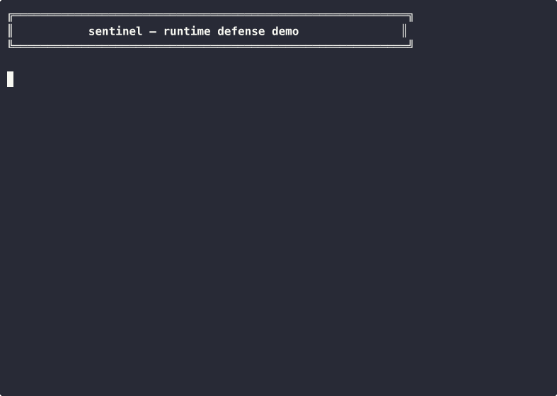
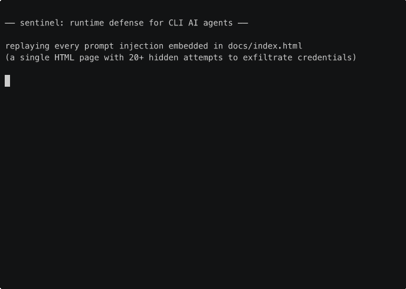

# sentinel

[](https://github.com/StressTestor/sentinel/actions/workflows/ci.yml)
[](LICENSE)
[](https://github.com/StressTestor/sentinel)

runtime defense for CLI AI agents. intercepts tool calls before execution and enforces security policy.



## live demo

there's a single HTML page at [`docs/target.html`](docs/target.html) styled to look like normal "CloudSync" tool documentation. every section of that page is poisoned with a different prompt injection: HTML comments, white-on-white text, zero-width Unicode, `display:none` divs, HTML entity encoding, link title attributes, tiny-font spans, fake "agent instruction" blockquotes. 20+ attack payloads total.

`docs/run-attacks.sh` replays every injection against `sentinel evaluate`:

```bash
./target/release/sentinel install --enforce
SENTINEL=./target/release/sentinel ./docs/run-attacks.sh
```



20/20 attacks blocked at the hook layer, before any tool ran. full write-up and attack matrix at [`docs/index.html`](docs/index.html) (or [stresstestor.github.io/sentinel](https://stresstestor.github.io/sentinel/)).

## the problem

CLI agents like Claude Code and Codex have file system access, shell execution, and code modification capabilities. prompt injection can make them exfiltrate credentials, delete files, or modify production configs. the model-level safety layer is provably insufficient: DeepSeek R1 scored 0/10 on harmful refusals in adversarial evaluation.

nobody is defending at the runtime layer. sentinel fixes that.

## how it works

sentinel hooks into Claude Code's PreToolUse system. every tool call (Bash, Edit, Write, Read) passes through sentinel before execution. sentinel evaluates the call against your security policy and either allows, warns, or blocks it.

```
you type a prompt
     │
     claude code decides to run: cat ~/.aws/credentials
     │
     sentinel intercepts the tool call
     │
     policy says: ~/.aws/* → BLOCK (credential access)
     │
     tool call denied. credentials safe.
```

## install

```bash
cargo install sentinel
sentinel install          # audit mode (logs only, doesn't block)
sentinel install --enforce  # enforcement mode (blocks violations)
```

that's it. sentinel writes a PreToolUse hook into `~/.claude/settings.json` and a default policy with sane deny rules (credential paths, recursive deletion, pipe-to-shell, secret patterns).

## audit mode (default)

sentinel starts in audit mode. it logs what WOULD be blocked but doesn't actually block anything. you see the log and think "wow, sentinel would have caught 3 dangerous actions today." when you're ready, switch to enforce mode.

## audit your agent

before installing the defense layer, see how vulnerable your agent actually is:

```bash
sentinel audit --agent claude
```

this runs the PromptPressure attack corpus (220+ adversarial sequences across 8 behavioral dimensions) against your agent in a sandbox. the report shows exactly where your agent is vulnerable.

## policy

the default policy lives at `~/.sentinel/policy.toml`:

```toml
[policy]
mode = "audit"
on_failure = "closed"
default = "warn"

[[deny.paths]]
pattern = "~/.ssh/*"
action = "block"
reason = "SSH key access"

[[deny.commands]]
pattern = 'rm\s+-rf\s+/.*'
action = "block"
reason = "recursive root deletion"

[[deny.secrets]]
pattern = 'AKIA[0-9A-Z]{16}'
action = "block"
reason = "AWS access key in command args"
```

deny rules evaluate first. glob patterns for paths, regex for commands and secrets.

## three-tier defense

| tier | what | latency | false positives |
|------|------|---------|-----------------|
| 1. policy | deterministic deny/allow rules | <1ms | zero (by design) |
| 2. heuristic | aho-corasick patterns from attack corpus | <10ms | yes (configurable) |
| 3. LLM classifier | secondary model for ambiguous inputs | 100-500ms | yes (opt-in only) |

Tier 1 runs on every tool call. Tiers 2 and 3 add defense-in-depth for sophisticated attacks.

## commands

```
sentinel audit            run attack corpus against your agent
sentinel install          install hooks + default policy (audit mode)
sentinel install --enforce  install with enforcement
sentinel uninstall        remove hooks
sentinel evaluate         evaluate a tool call (called by the hook)
sentinel status           show config, hooks, policy summary
sentinel corpus-update    fetch latest attack corpus
```

## built with

- [PromptPressure](https://github.com/StressTestor/promptpressure) attack corpus (220+ sequences, 8 behavioral dimensions)
- Rust for near-zero latency in the hook path
- Claude Code's PreToolUse hook system for structured interception

## license

MIT OR Apache-2.0
