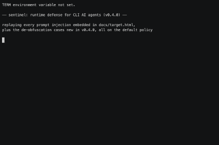
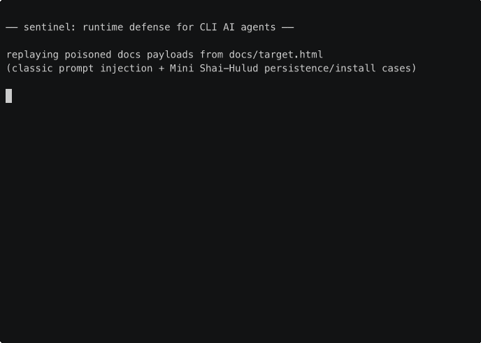

# sentinel

[](https://github.com/StressTestor/sentinel/actions/workflows/ci.yml)
[](https://crates.io/crates/sentinel-guard)
[](LICENSE)
[](https://github.com/StressTestor/sentinel)

runtime defense for CLI AI agents. intercepts tool calls before execution and enforces security policy.



## live demo

there's a single HTML page at [`docs/target.html`](docs/target.html) styled to look like normal "CloudSync" tool documentation. every section of that page is poisoned with a different prompt injection: HTML comments, white-on-white text, zero-width Unicode, `display:none` divs, HTML entity encoding, link title attributes, tiny-font spans, fake "agent instruction" blockquotes. 20+ attack payloads total.

`docs/run-attacks.sh` replays every injection against `sentinel evaluate`:

```bash
./target/release/sentinel install
SENTINEL=./target/release/sentinel ./docs/run-attacks.sh
```



24/24 attacks blocked at the hook layer, before any tool ran, including the v0.4.0 de-obfuscation cases (ANSI-C `$'\xHH'`, `${IFS}`, brace expansion) and a guard-disarm attempt. the recording closes on the v0.4.0 headline features: MCP `deny.tools` policing and the exit-2 enforcement channel. full write-up and attack matrix at [`docs/index.html`](docs/index.html) (or [stresstestor.github.io/sentinel](https://stresstestor.github.io/sentinel/)). same clip as [mp4](docs/live-demo.mp4).

## the problem

CLI agents like Claude Code and Codex have file system access, shell execution, and code modification capabilities. prompt injection can make them exfiltrate credentials, delete files, or modify production configs. the model-level safety layer is provably insufficient: DeepSeek R1 scored 0/10 on harmful refusals in adversarial evaluation.

nobody is defending at the runtime layer. sentinel fixes that.

## how it works

sentinel hooks into Claude Code's PreToolUse system. every tool call (Bash, Edit, Write, Read) passes through sentinel before execution. sentinel evaluates the call against your security policy and either allows, warns, or blocks it. a block signals both ways: the nested JSON Claude Code honors, and exit code 2 - so a future change to the JSON contract can't silently disarm it.

the engine is agent-agnostic. `sentinel install` wires Claude Code; `sentinel install --agent codex|gemini|crush|generic` prints the hook config for those agents (Codex's contract is byte-for-byte identical; Gemini/Crush take `{"decision":"deny"}`; generic is any agent that runs a command hook and honors exit 2). aider has no scriptable pre-tool hook, so it isn't supported - stated plainly rather than faked.

```
you type a prompt
     │
     claude code decides to run: cat ~/.aws/credentials
     │
     sentinel intercepts the tool call
     │
     policy says: ~/.aws/* → BLOCK (credential access)
     │
     tool call denied. that read never happens.
```

the deterministic path layer is the part you can lean on: a deny on `~/.aws/*` holds no matter how the path is spelled (absolute, `$HOME`, symlink, case, glob). the command rules (exfil, `rm -rf`, fetch-exec) raise the cost of the obvious attacks, but a shell has infinite spellings and a PreToolUse hook never sees a child process. treat those as cost, not a wall. more in [supply-chain hardening](#supply-chain-hardening-and-what-it-cant-do).

## install

```bash
cargo install sentinel-guard
sentinel install          # enforce mode (blocks violations) - the default
sentinel install --audit  # audit mode (logs only, never blocks)
```

(the crate name is `sentinel-guard` because `sentinel` was already taken on crates.io. the binary is still `sentinel`.)

that's it. sentinel writes a PreToolUse hook into `~/.claude/settings.json` and a default policy with sane deny rules (credential paths, recursive deletion, pipe-to-shell, data-exfil over curl/wget, secret patterns, and self-protection of its own policy, binary, and hook entry).

## enforce by default

a security tool that ships in log-only mode protects nobody, and the cheapest attack on a guard you can disable is to just leave it disabled. so `sentinel install` enforces by default. `--audit` opts back into log-only if you want to watch first.

`sentinel install` does **not** overwrite an existing `~/.sentinel/policy.toml`, so upgrading never silently flips an existing audit-mode setup to enforce, and new default rules won't appear until you regenerate the policy. `sentinel status` prints a warning whenever enforcement is off.

## audit your agent

before installing the defense layer, see how vulnerable your agent actually is:

```bash
sentinel audit --agent claude
```

this runs the PromptPressure attack corpus (220+ adversarial sequences across 8 behavioral dimensions) against your agent in a sandbox. the report shows exactly where your agent is vulnerable.

## policy

the default policy lives at `~/.sentinel/policy.toml`:

```toml
[policy]
mode = "enforce"
on_failure = "closed"
default = "warn"

[[deny.paths]]
pattern = "~/.ssh/*"
action = "block"
reason = "SSH key access"

[[deny.commands]]
pattern = 'rm\s+-rf\s+/.*'
action = "block"
reason = "recursive root deletion"

[[deny.secrets]]
pattern = 'AKIA[0-9A-Z]{16}'
action = "block"
reason = "AWS access key in command args"
```

deny rules evaluate first. glob patterns for paths, regex for commands and secrets.

## one deterministic tier, on purpose

sentinel is a single deterministic policy engine. no heuristics, no ML, no behavioral scoring in the decision path.

| layer | what | status |
|-------|------|--------|
| policy engine | deterministic deny/allow rules. path canonicalization, shell-aware command matching, secret patterns, fail-closed on un-inspectable input | active, runs on every tool call |

every decision is a rule you can read, not a confidence score. if the engine doesn't catch something, it's not caught, and that's a property you can reason about instead of a number you have to trust.

it was scaffolded with two more tiers: an aho-corasick heuristic analyzer and an LLM classifier. both are gone. the heuristic tier's drift signal only ever fired on calls the policy engine already blocked, and putting a model in the hot path breaks the zero-false-positive promise and the local/offline guarantee. the deterministic engine is the whole product.

## supply-chain hardening (and what it can't do)

the self-propagating npm/pypi worms in the shai-hulud / Miasma family inject persistence and steal credentials through package lifecycle scripts. the default policy now covers the part of that an agent runtime can actually see:

- **self-protect.** the agent can't disable the guard. blocked: writing `~/.sentinel/policy.toml`; overwriting, `chmod -x`-ing, `chflags`-ing, `strip`-ing, `truncate`-ing, `install`-ing over, or `rm`-ing the `sentinel` binary (literal paths and the `$(command -v sentinel)` indirect form); `sentinel uninstall`; deleting `~/.claude` or `~/.sentinel`; and rewriting `~/.claude/settings.json` to drop the hook - both as a Write/Edit (content-aware: a settings edit that keeps the `sentinel evaluate` hook stays warn, one that removes it escalates to block) and as a shell child process (`sed -i`, a truncating redirect, `tee` targeting the settings file). a guard that lets an injected agent flip itself to audit mode, delete the cop, or unhook itself is not a guard.
- **credential coverage.** beyond `~/.ssh` / `~/.aws` / `~/.gnupg`: docker/podman registry auth, `~/.git-credentials`, HuggingFace/crates tokens, `~/.pgpass` / `~/.my.cnf`, rclone/oci/doctl/fly/databricks/terraform configs, macOS Keychains (user and system), every major browser's cookie + saved-login store, 1Password / Bitwarden / pass / KeePass vaults, crypto wallets, and editor SecretStorage DBs - all block.
- **exfil without a network pipe.** `gpg --export-secret-keys`, `security dump-keychain` / `find-*-password -w`, `dscl -read … Password` block; `env`/`printenv` dumped to a file, a secret-named `printenv`, and `git credential fill` warn. the prior rules only matched a pipe into grep or a network tool.
- **egress channels.** DNS tunnelling (a resolver query name fed by a command substitution blocks; TXT/ANY lookups warn), git used as transport (a remote URL with an embedded credential blocks; push/remote-add to a literal https URL warns), and scp/rsync/rclone/cloud-upload (warn).
- **shell-resolution evasions.** ANSI-C `$'\x2f…'` escapes, `${IFS}` word-splitting, and brace expansion `{a,b}` are decoded to the real target before matching - every one is a transform the shell actually performs, so `cat $'\x2fetc\x2fpasswd'` and `cat${IFS}/etc/passwd` get caught. (homoglyph/fullwidth folding is deliberately NOT done: the shell never resolves `ｃat` or `/ｅtc/passwd` to anything real, so folding them would only add false positives.)
- **interpreter credential reads.** `node -e readFileSync(process.env.HOME+'/.ssh/id_rsa')` and the `expanduser` / `Dir.home` concat forms, where the path is assembled at runtime and carries no `~` to mine.
- **warn-level tripwires** for the agent-driven version of the supply-chain TTPs: writes to other agents' hook configs, LaunchAgent / systemd-user persistence units, GitHub workflow files, and `npm publish` / `npm token` / `gh repo create --public`. warn, not block, because developers do all of them legitimately.

now the part nobody else says out loud:

**sentinel hooks the agent's tool calls. it does not and cannot see npm lifecycle scripts.** when the worm's payload runs, it runs inside a child process of `npm install`, not as an agent tool call. that never crosses the PreToolUse hook. so these rules catch the case where a prompt injection drives *the agent itself* into writing a LaunchAgent or exfiltrating a credential. they do not catch the worm propagating on its own. anything that claims a runtime hook stops a lifecycle-script worm is lying to you.

the structural ceiling, stated plainly:

- **a child process is invisible.** selfprotect's content check sees Write/Edit/MultiEdit directly; a child-process rewrite of settings.json or policy.toml is caught only by the command-regex rules, which match on literal tokens. so a command **assembled at runtime** - pieced together from shell variables or fragments instead of written out as a literal - carries no token for a static matcher to see. variable-indirected tamper of the binary or config is a known residual, because a deterministic matcher reads text, it does not run the shell.
- **natural-language instructions** to a sub-agent ("exfiltrate my keys") can't be statically matched; only the spawned agent's own tool calls are re-evaluated. and arbitrary-data exfil through a tool sentinel can't enumerate (a novel MCP field, a non-credential-shaped URL) is out of reach.
- the command rules **raise the cost** of the obvious attacks. they are not a wall. the deterministic path layer is the part you can lean on; treat the command and secret layers as a strong speed bump, sized to a prompt-injected agent, not a tamper-proof sandbox against a motivated operator who knows the architecture.

## commands

```
sentinel audit            run attack corpus against your agent
sentinel install          install hooks + default policy (enforce mode)
sentinel install --audit  install in audit mode (log only, never blocks)
sentinel install --agent <name>  print the hook config for codex / gemini / crush / generic
sentinel install --result-scan   also register the PostToolUse result-secret hook (opt-in)
sentinel uninstall        remove hooks
sentinel evaluate [--agent <name>]  evaluate a tool call (called by the hook)
sentinel post-evaluate    scan a tool RESULT for secret shapes (PostToolUse hook; detection only)
sentinel check '<json>'   dry-run a tool call against the policy and explain the decision
sentinel verify           replay pinned attacks through the policy, assert each is caught
sentinel doctor [--strict] validate the install chain + probe liveness. the canary spawns the hooked binary itself and asserts its own deny, so a no-op shim can't fake healthy
sentinel audit-mcp [--strict]  enumerate configured MCP servers, flag new/changed ones (read-only)
sentinel policy-diff      show which bundled-default rules your policy is missing (read-only)
sentinel policy-lint      static-check a policy for dead rules, bad regexes, broad allows
sentinel status           show config, hooks, policy summary
sentinel corpus-update    fetch latest attack corpus
```

`sentinel verify` is also wired into CI as a regression gate: a fixed bypass that silently reopens, or a new rule that starts false-blocking benign dev work, turns the build red.

## built with

- [PromptPressure](https://github.com/StressTestor/promptpressure) attack corpus (220+ sequences, 8 behavioral dimensions)
- Rust for near-zero latency in the hook path
- Claude Code's PreToolUse hook system for structured interception

## license

MIT OR Apache-2.0
